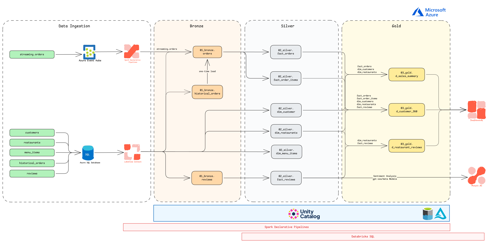

# Restaurant Analytics Lakehouse on Azure Databricks

An end-to-end data engineering project built on **Azure Databricks** for ingesting, transforming, and analyzing restaurant data using batch and streaming data pipelines.

## Architecture



## Technology Stack

- Azure Databricks
- Azure SQL Database
- Azure Event Hubs
- Lakeflow Connect
- Spark Declarative Pipelines
- Delta Lake
- Unity Catalog
- Databricks Workflows
- PySpark & SQL
- Databricks AI/BI Dashboards

## Data Engineering Pipeline

The project follows a **Medallion Architecture**:

```text
Azure SQL Database ──┐
                     ├──> Bronze ──> Silver ──> Gold ──> AI/BI Dashboards
Azure Event Hubs ────┘
```

### Bronze
- Ingested raw order, review data.
- Used Lakeflow Connect for Azure SQL ingestion.
- Used Spark Structured Streaming for Event Hubs data.

### Silver
- Ingested raw restaurant, customer, and menu data.
- Cleaned and standardized source data.
- Applied joins, transformations, type conversions, and business logic.
- Built fact and dimension datasets.

### Gold
- Created business-ready datasets for analytics.
- Built customer, restaurant, sales, and review metrics.

## Key Features

- Batch ingestion from Azure SQL Database using Lakeflow Connect.
- SQL Server Change Tracking configured for incremental-ingestion scenarios.
- Streaming ingestion from Azure Event Hubs using Spark Structured Streaming.
- Delta Lake tables with ACID transactions, MERGE operations, and table history.
- Unity Catalog for data organization and governance.
- Spark Declarative Pipelines for Bronze-to-Gold transformations.
- Databricks Workflows for pipeline orchestration.
- Databricks AI/BI dashboards for restaurant performance and review analytics.

## Dashboards

Two Databricks AI/BI dashboards were created:

- **Restaurant Chain Performance Dashboard** — sales, orders, customers, AOV, best-selling items, peak hours, order types, and food categories.
- **Review Insights Dashboard** — review volume, ratings, sentiment, issue categories, and review trends.

[View Dashboard Screenshots](dashboards/DASHBOARD_README.md)

## Project Structure

```text
├── dashboards/
├── diagrams/
├── pipelines/
│   ├── pipeline_bronze_to_gold/
│   |   ├── gold/
|   |   |   ├── d_customer_360.py
|   |   |   ├── d_resturant_reviews.py
|   |   |   └── d_sales_summary.py
│   |   └── silver/
|   |       ├── fact_orders_items.py
|   |       ├── fact_orders.py
|   |       └── fact_reviews.sql
|   └── pipeline_ingest_eventhub.py
├── synthetic_data/
|   ├── data/
|   ├── sql/
|   |   ├── azuresqldatabase_setup.sql
|   |   ├── gold_schema.md
|   |   ├── silver_schema.md
|   |   └── utility_script.sql
|   ├── 00_sql_db.py
|   ├── 01_historical_orders.py
|   ├── 02_reviews.py
|   ├── 03_run.py
|   ├── 04_eventhub_orders.py
|   └── requirements.txt
├── .gitignore
└── README.md
```

## Security

Credentials and connection strings are kept outside the repository using environment variables / secret management. `.env` files are excluded through `.gitignore`.

## Author

**Ketan Jain**  
Data Engineer | Azure Databricks | PySpark | SQL | Python
