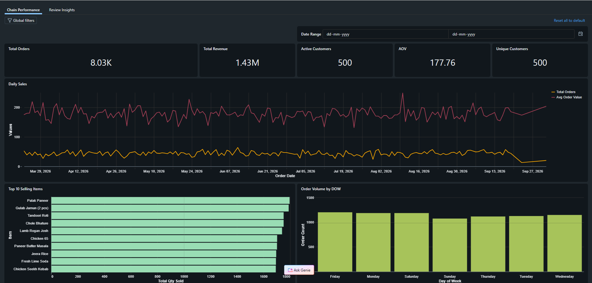
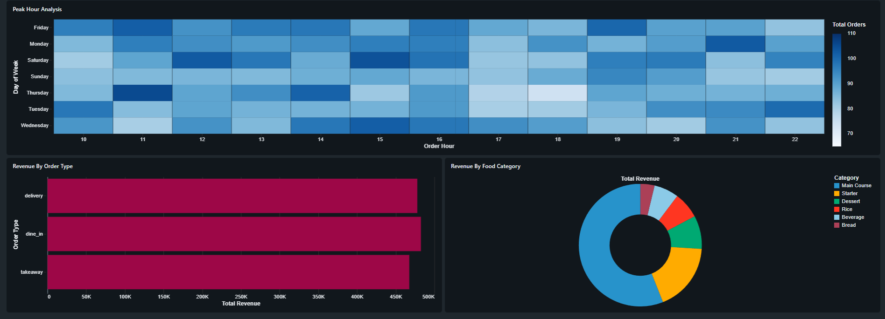
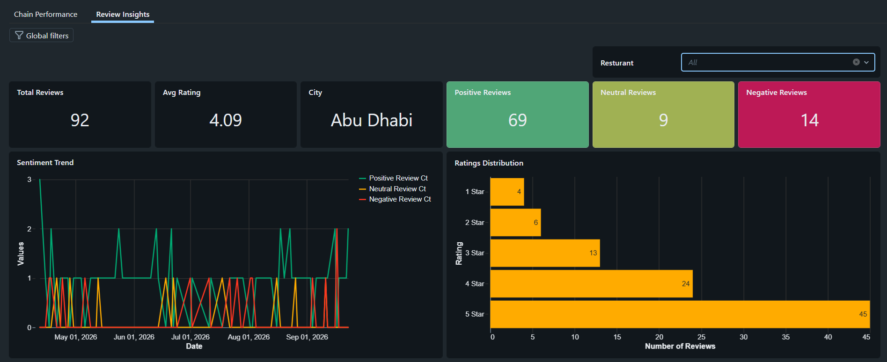
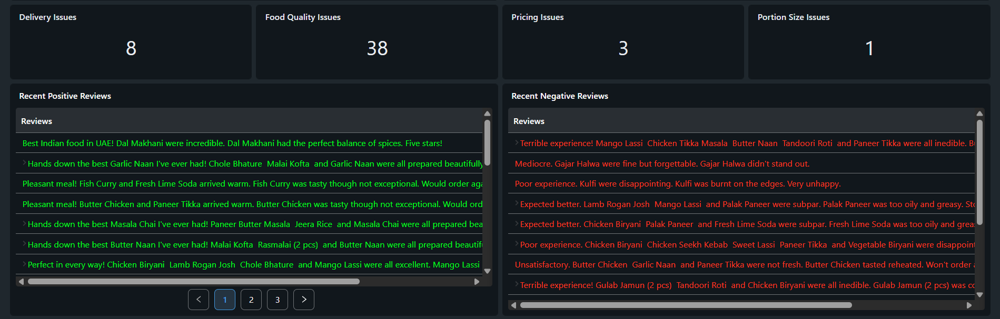

# Databricks AI/BI Dashboards

This project includes two Databricks AI/BI dashboards built on top of the
Silver and Gold layer datasets.

---

## 1. Restaurant Chain Performance Dashboard

Provides an overview of restaurant sales, orders, customers, and
operational performance.

### Key Metrics & Analysis

- Total Orders
- Total Revenue
- Active Customers
- Average Order Value (AOV)
- Unique Customers
- Daily Sales
- Best Selling Items
- Order Volume by Day of Week
- Peak Hour Analysis
- Revenue by Order Type
- Revenue by Food Category

The dashboard supports filtering by date range.

### Dashboard Screenshots

---

## 2. Review Insights Dashboard

Provides insights into customer reviews, ratings, sentiment, and
restaurant-level feedback.

### Key Metrics & Analysis

- Review Volume Over Time
- Average Rating
- Restaurant / City
- Positive Review Count
- Neutral Review Count
- Negative Review Count
- Sentiment Trend
- Ratings Distribution
- Issue Categorization
  - Delivery
  - Food Quality
  - Pricing
  - Portion Size
- Recent Positive / Negative Reviews

The dashboard supports filtering by restaurant name.

### Dashboard Screenshots

